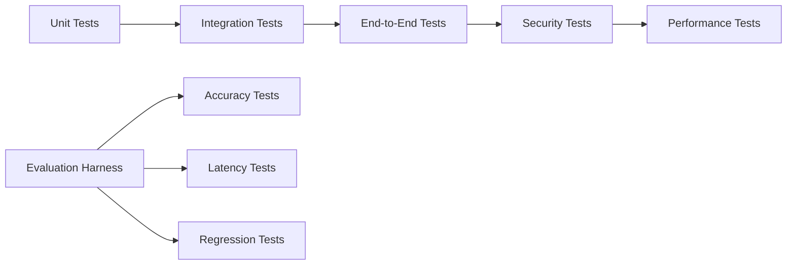

# FounderForge AI Cofounder - Design Document

## Setup and Dependencies

**To run locally:**
- Install: `pip install langgraph faiss-cpu sqlite3 google-generativeai streamlit langchain sentence-transformers pytest psutil`
- Set env: `export GEMINI_API_KEY=your_key_here`
- Start: `streamlit run app.py` or `python cli.py`
- **All data stays local; only Gemini API calls are external.**

## Overview

FounderForge is a localhost-first AI virtual cofounder system designed to assist entrepreneurs with strategic decision-making, funding guidance, and operational support. The system leverages local storage, efficient AI workflows, and Google's **Gemini 2.5 Flash API** to provide fast, personalized assistance while maintaining complete data privacy and control.

**All data and processing remain local, with only outbound API calls to Gemini for LLM inference.** The architecture emphasizes modularity, performance optimization, and rapid iteration capabilities, with all core functionality running locally except for LLM API calls to Gemini.

## Architecture

### High-Level Architecture

```mermaid
graph TB
    UI[Web Interface<br/>Streamlit/Flask] --> Core[Core Engine]
    CLI[CLI Interface] --> Core
    
    Core --> Context[Context Manager]
    Core --> Memory[Memory System]
    Core --> Agents[Agent Orchestrator]
    Core --> Config[Configuration Manager]
    
    Context --> Files[Local Files<br/>JSON/Text<br/>(Local Only)]
    Context --> Summarizer[Local Summarizer]
    
    Memory --> SQLite[(SQLite Database<br/>(Local Only))]
    Memory --> FAISS[FAISS Vector Store<br/>(Local Only)]
    
    Agents --> LangGraph[LangGraph Workflows]
    Agents --> Gemini[Gemini 2.5 Flash API]
    
    Config --> Git[Git Repository]
    Config --> Flags[Feature Flags]
    
    Eval[Evaluation Framework] --> Core
    Security[Security Testing] --> Core
    Logging[Logging & Monitoring<br/>(Local Files)] --> Core
```

### System Layers

1. **Interface Layer**: Web UI (Streamlit/Flask) and CLI for user interaction
2. **Core Engine**: Central orchestration and business logic
3. **Context Layer**: Intelligent context assembly and management
4. **Memory Layer**: Persistent storage and retrieval systems
5. **Agent Layer**: Multi-agent workflows and LLM integration
6. **Configuration Layer**: Feature flags, Git integration, and settings
7. **Testing Layer**: Evaluation framework and security testing
8. **Logging Layer**: Local file-based metrics for iteration

## Components and Interfaces

### Core Engine

**Purpose**: Central coordinator for all system operations

**Key Classes**:
- `FounderForgeEngine`: Main application controller
- `RequestProcessor`: Handles user requests and routing
- `ResponseGenerator`: Formats and delivers responses

**Interfaces**:
```python
class IFounderForgeEngine:
    def process_request(self, user_id: str, request: str) -> Response
    def get_user_context(self, user_id: str) -> UserContext
    def update_memory(self, user_id: str, interaction: Interaction) -> bool
```

### Context Manager

**Purpose**: Assembles relevant context from multiple local sources

**Key Classes**:
- `ContextAssembler`: Combines data from various sources
- `TokenManager`: Monitors and manages token usage
- `ContextSummarizer`: Reduces context size when needed

**Context Sources**:
- Chat history (JSON files)
- User goals and preferences (SQLite)
- Business data (local text files)
- Guard rails and rules (configuration files)

**Interfaces**:
```python
class IContextManager:
    def assemble_context(self, user_id: str, query: str) -> Context
    def summarize_context(self, context: Context, max_tokens: int) -> Context
    def log_token_usage(self, usage: TokenUsage) -> None
```

### Memory System

**Purpose**: Persistent storage and retrieval of user information

**Storage Components**:
- **SQLite Database**: Structured data storage
  - Users table: Basic user information
  - Conversations table: Chat history metadata
  - Memory table: Short-term and long-term memories
  - Business_data table: Company and project information

- **FAISS Vector Store**: Semantic search capabilities
  - Document embeddings for context retrieval
  - Conversation embeddings for similar query matching

**Interfaces**:
```python
class IMemorySystem:
    def store_memory(self, user_id: str, memory: Memory) -> bool
    def retrieve_memories(self, user_id: str, query: str, limit: int) -> List[Memory]
    def delete_user_data(self, user_id: str, data_type: str) -> bool
    def get_retention_status(self, user_id: str) -> RetentionInfo
```

### Agent Orchestrator

**Purpose**: Manages multi-agent workflows for complex tasks

**Agent Types**:
- **Orchestrator Agent**: Coordinates multi-step processes
- **Validator Agent**: Validates data and responses
- **Planner Agent**: Creates action plans and strategies
- **Tool-Caller Agent**: Executes local tools and APIs
- **Coach Agent**: Provides motivational and strategic guidance

**Workflow Engine**: LangGraph-based state management

**Gemini Integration**: Uses `google.generativeai` SDK for API calls. Implements retries for network issues and local mocking for tests.

**Interfaces**:
```python
class IAgentOrchestrator:
    def execute_workflow(self, workflow_type: str, input_data: dict) -> WorkflowResult
    def get_available_agents(self) -> List[AgentInfo]
    def log_agent_execution(self, execution_log: ExecutionLog) -> None
    def call_gemini_api(self, prompt: str, retries: int = 3) -> GeminiResponse
```

### Configuration Manager

**Purpose**: Manages feature flags, Git integration, and system settings

**Components**:
- Feature flag system (JSON-based)
- Git integration for prompt versioning
- Environment configuration
- Experiment tracking

**Interfaces**:
```python
class IConfigurationManager:
    def get_feature_flag(self, flag_name: str) -> bool
    def update_feature_flag(self, flag_name: str, value: bool) -> None
    def commit_prompt_changes(self, changes: List[PromptChange]) -> str
    def rollback_experiment(self, experiment_id: str) -> bool
```

## Data Models

### Core Data Models

```python
@dataclass
class UserContext:
    user_id: str
    goals: List[str]
    business_info: BusinessInfo
    chat_history: List[Message]
    preferences: UserPreferences
    token_count: int

@dataclass
class Memory:
    id: str
    user_id: str
    content: str
    memory_type: MemoryType  # SHORT_TERM, LONG_TERM
    confidence: float
    created_at: datetime
    expires_at: Optional[datetime]

@dataclass
class WorkflowResult:
    success: bool
    result_data: dict
    execution_time: float
    agent_logs: List[AgentLog]
    confidence_score: float

@dataclass
class Response:
    content: str
    confidence: float
    sources: List[str]
    fallback_used: bool
    token_usage: TokenUsage
```

### Database Schema

```sql
-- Users table
CREATE TABLE users (
    id TEXT PRIMARY KEY,
    name TEXT,
    email TEXT,
    created_at TIMESTAMP,
    preferences TEXT  -- JSON blob
);

-- Memory table
CREATE TABLE memories (
    id TEXT PRIMARY KEY,
    user_id TEXT,
    content TEXT,
    memory_type TEXT,
    confidence REAL,
    created_at TIMESTAMP,
    expires_at TIMESTAMP,
    FOREIGN KEY (user_id) REFERENCES users (id)
);
CREATE INDEX idx_memory_user ON memories(user_id);

-- Conversations table
CREATE TABLE conversations (
    id TEXT PRIMARY KEY,
    user_id TEXT,
    message TEXT,
    response TEXT,
    timestamp TIMESTAMP,
    token_usage REAL,
    FOREIGN KEY (user_id) REFERENCES users (id)
);
```

## Error Handling

### Error Categories

1. **API Errors**: Gemini API failures, rate limiting
2. **Storage Errors**: SQLite connection issues, disk space
3. **Context Errors**: Token limit exceeded, invalid data
4. **Agent Errors**: Workflow failures, timeout issues
5. **Security Errors**: PII detection, injection attempts
6. **Network Errors**: Gemini connectivity issues

### Error Handling Strategy

```python
class ErrorHandler:
    def handle_api_error(self, error: APIError) -> FallbackResponse:
        # Use local fallback mechanisms (checklists, templates)
        pass
    
    def handle_storage_error(self, error: StorageError) -> bool:
        # Implement graceful degradation
        pass
    
    def handle_context_error(self, error: ContextError) -> Context:
        # Apply summarization or filtering
        pass
```

### Fallback Mechanisms

- **Low Confidence Responses**: Switch to interactive checklists
- **API Failures**: Use local templates and cached responses
- **Storage Issues**: Temporary in-memory storage with warnings
- **Context Overflow**: Automatic summarization and prioritization

## Testing Strategy

### Testing Framework Architecture



### Test Categories

1. **Unit Tests**: Individual component testing
   - Context assembly logic
   - Memory storage/retrieval
   - Agent workflow steps
   - Configuration management

2. **Integration Tests**: Component interaction testing
   - End-to-end conversation flows
   - Multi-agent coordination
   - Database and vector store integration

3. **Performance Tests**: Speed and efficiency validation
   - Sub-10ms memory retrieval
   - Under 30-second form processing
   - Under 1-minute parallel task processing

4. **Security Tests**: Vulnerability assessment
   - PII detection accuracy
   - Injection attack simulation
   - Data leak prevention

5. **Evaluation Harness**: AI quality assessment
   - 90% accuracy on predefined scenarios
   - Confidence threshold validation
   - Fallback mechanism effectiveness

### Test Data Management

- **Local Test Datasets**: Curated query sets for consistent evaluation
- **Synthetic Data Generation**: Create diverse test scenarios
- **Privacy-Safe Testing**: No real user data in test environments
- **Local Test Execution**: pytest and Makefile scripts for localhost testing

## Performance Optimization

### Key Performance Targets

- **Memory Retrieval**: < 10ms for SQL queries
- **Context Assembly**: < 2 seconds for full context
- **Agent Workflows**: < 30 seconds for complex tasks
- **API Response**: < 5 seconds total response time
- **Token Management**: Stay under 16k tokens consistently

### Optimization Strategies

1. **Database Optimization**:
   - Proper indexing on frequently queried columns
   - Connection pooling for SQLite
   - Prepared statements for common queries

2. **Context Optimization**:
   - Lazy loading of context components
   - Intelligent summarization algorithms
   - Caching of frequently accessed data

3. **Agent Optimization**:
   - Parallel execution where possible
   - Workflow checkpointing for recovery
   - Resource pooling for agent instances

4. **Memory Management**:
   - Efficient data structures
   - Garbage collection optimization
   - Memory usage monitoring alerts